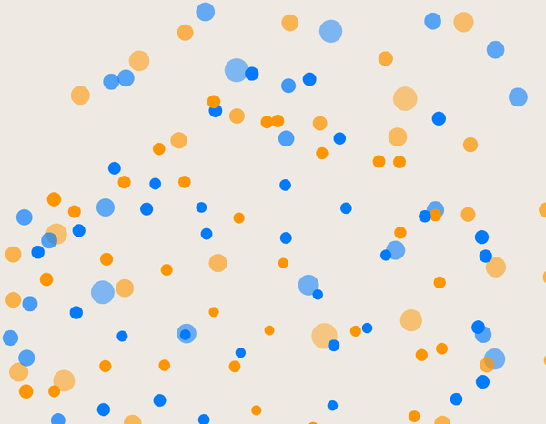
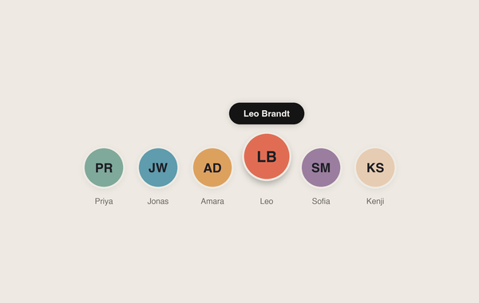
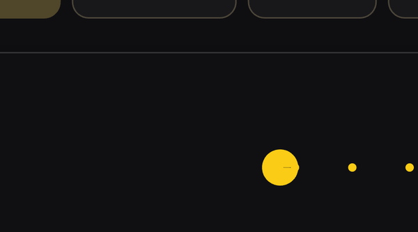
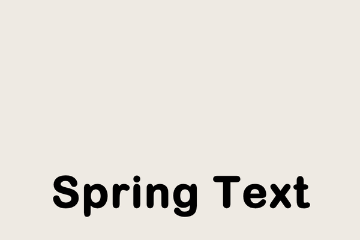

# Flutter Craft ✦

<p align="center">
  <strong>A curated collection of delightful, Apple-grade animations, tactile micro-interactions, and modern components for Flutter.</strong>
</p>

<p align="center">
  <a href="https://flutter.dev"></a>
  <a href="#license"></a>
  <a href="#why-flutter-craft"></a>
  <a href="#contributing--requesting-animations"></a>
</p>

---

## 💡 About The Project

There are countless breathtaking, fluid animations and tactile interactions across iOS (SwiftUI), modern web experiments, and design showcases that simply do not exist in the Flutter ecosystem. Most available Flutter packages either introduce heavy dependency trees or focus on generic Material Design defaults.

**Flutter Craft** is an open-source initiative to bridge that gap.

The goal is to recreate and craft the most beautiful, organic, and tactile micro-interactions you see around the digital world into Flutter. Every component is engineered to be **100% self-contained in a single file** so the Flutter community can easily grab, drop, and customize them into any project without dependency headaches.

### 🌟 Why Flutter Craft?

- 📋 **Single-File Copy & Paste:** No bloated `pubspec.yaml` dependencies. Every component lives in a single, clean `.dart` file that you can copy directly into your codebase.
- 🎨 **Theme-Adaptive by Default:** Built to seamlessly adapt between Light and Dark mode. Light mode adopts a warm off-white canvas with crisp dark elements, while Dark mode delivers deep OLED black immersion.
- ⚙️ **Effortless Customization:** Every component exposes straightforward parameters for colors, sizing, speeds, and physics so you can tailor it to your app's brand in seconds.
- 🍏 **Tactile Physics & Natural Motion:** Built with authentic spring simulations, velocity conservation, and mathematically rigorous curves instead of stiff linear timers.
- ♿ **Accessibility & Reduced Motion:** Respects user motion preferences (`MediaQuery.disableAnimationsOf(context)`) automatically.

---

## 📦 Component Catalog

| Preview | Component | Description |
| :---: | :--- | :--- |
|  | [**Breathing Loader**](lib/animations/breathing_loader/breathing_loader.dart)<br><br>`3D Math` `Particles` `Perspective` | A transparent 3D particle sphere engineered with 170 Fibonacci-distributed points on a unit sphere. Features continuous dual-axis rotation, harmonic radial breathing expansion, perspective projection, depth-sorted alpha blending, and seamless theme palettes.<br><br>[📖 View Documentation](lib/animations/breathing_loader/README.md) |
|  | [**Profile Stack**](lib/animations/profile_stack/profile_stack.dart)<br><br>Gestures Avatars Spring Controls | An interactive avatar group control that sits in an overlapping chain and springs open into a selectable horizontal fan with live scrubbing, floating capsule name tags, and an original Studio Ceramic palette.<br><br>[📖 View Documentation](lib/animations/profile_stack/README.md) |
|  | [**Pacman Loader**](lib/animations/pacman_loader/pacman_loader.dart)<br><br>`Interactive` `Loader` `CustomPainter` | A retro-inspired, rhythmic loading indicator where Pacman munches glowing dots across a track. Features an interpolated live percentage counter, adaptive light/dark colors, and zero external packages.<br><br>[📖 View Documentation](lib/animations/pacman_loader/README.md) |
|  | [**Spring Text**](lib/animations/spring_text/spring_text.dart)<br><br>`Gestures` `Physics` `SpringSimulation` | A tactile line of text that bends along a natural catenary curve under vertical drag gestures and snaps back with authentic spring physics upon release. Supports gesture interruptibility mid-flight and dynamic typography scaling.<br><br>[📖 View Documentation](lib/animations/spring_text/README.md) |

---

## 🚀 How to Use in Your App

You don't need to install any package. Simply follow these steps:

### 1. Copy the Component File
Navigate to the component folder inside [`lib/animations/`](lib/animations/) and copy the `.dart` file (e.g., [`breathing_loader.dart`](lib/animations/breathing_loader/breathing_loader.dart)) into your own Flutter project.

### 2. Import & Use Directly
Use the widget anywhere in your widget tree:

```dart
import 'package:your_app/widgets/breathing_loader.dart';

// Drop it into your widget tree:
const BreathingLoader(
  sphereSize: 140,
  breathingSpeed: Duration(seconds: 4),
  dotSize: 3.5,
)
```

### 3. Customize for Your Theme
All components automatically resolve colors based on `Theme.of(context).brightness`, but you can also pass explicit custom colors or styles:

```dart
BreathingLoader(
  primaryColor: Colors.deepPurpleAccent,
  secondaryColor: Colors.cyanAccent,
)
```

---

## 📱 Running the Showcase Gallery Locally

To test and play with all animations on your device or simulator:

1. **Clone the repository:**
   ```bash
   git clone https://github.com/charugupta-dev/flutter_craft.git
   cd flutter_craft
   ```

2. **Run the showcase app:**
   ```bash
   flutter run
   ```

3. Toggle between **Light** and **Dark** themes directly in the app to preview adaptive color transitions in real-time.

---

## 📂 Repository Structure

```text
flutter_craft/
├── assets/
│   └── previews/               # Visual previews for documentation
├── lib/
│   ├── animations/             # Independent, self-contained components
│   │   ├── breathing_loader/
│   │   │   ├── breathing_loader.dart  # 🌟 Single-file drop-in
│   │   │   └── README.md
│   │   ├── profile_stack/
│   │   │   ├── profile_stack.dart         # 🌟 Single-file drop-in
│   │   │   └── README.md
│   │   ├── pacman_loader/
│   │   │   ├── pacman_loader.dart     # 🌟 Single-file drop-in
│   │   │   └── README.md
│   │   └── spring_text/
│   │       ├── spring_text.dart       # 🌟 Single-file drop-in
│   │       └── README.md
│   ├── gallery/                # Showcase catalog UI
│   │   ├── screens/
│   │   └── widgets/
│   ├── theme/                  # Design system & color tokens
│   └── main.dart               # App entrypoint
└── test/                       # Unit and widget tests
```

---

## 🤝 Contributing & Requesting Animations

Have you spotted a gorgeous animation on iOS (SwiftUI), Twitter/X, Dribbble, or a website that you'd love to see in Flutter?

1. **Suggest an Animation:** Open an [Issue](https://github.com/charugupta-dev/flutter_craft/issues) with a video, GIF, or link to the reference design.
2. **Submit a Component:**
   - Keep your component completely self-contained in `lib/animations/<name>/<name>.dart`.
   - Ensure **zero external dependencies** outside the Flutter SDK.
   - Include light and dark mode adaptive support.
   - Add a brief `README.md` with usage examples.
   - Submit a Pull Request!

---

## 📄 License

This project is licensed under the [MIT License](LICENSE). You are free to use, modify, and distribute these components in both personal and commercial projects.
